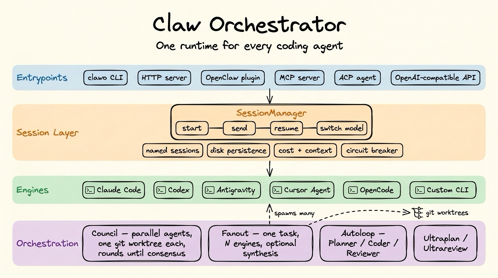
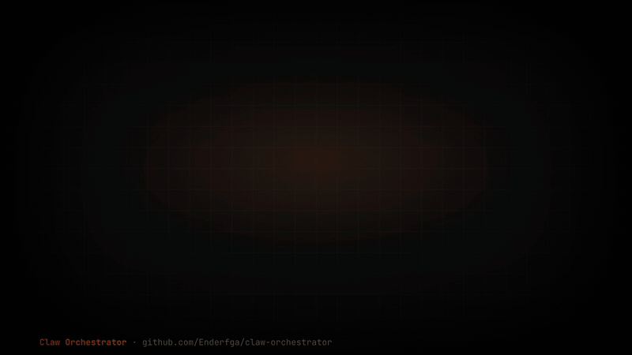

<p align="center">
  
</p>

# Claw Orchestrator

**Run Claude Code, Codex, Antigravity, Grok Build and OpenCode behind one runtime, and a run only counts as done when checks it didn't write pass.**

[](https://www.npmjs.com/package/@enderfga/claw-orchestrator)
[](https://www.npmjs.com/package/@enderfga/claw-orchestrator)
[](https://github.com/Enderfga/claw-orchestrator/actions/workflows/ci.yml)
[](https://opensource.org/licenses/MIT)

<p align="center">
  
</p>

<p align="center"><sub>
One bug, one acceptance contract, five engines, three runs each, first attempt only. The runtime ran the checks itself:
9 verified, 4 refuted, 2 errored (Grok Build hit its free-tier usage limit). One task, not a benchmark. Real runs, recorded locally —
<a href="./examples/promo-video/">how the film was made, and how to re-run it</a>.
</sub></p>

<details>
<summary><b>▶ The 40-second film, with sound</b></summary>

https://github.com/user-attachments/assets/5bf9bea8-e5ac-4632-a292-a80a45831dff

</details>

Coding agents grade their own work: "All tests pass ✓". Claw Orchestrator runs them as persistent sessions behind one API and keeps the verdict out of their hands. You declare the checks, the runtime executes them and reads the exit codes, and the evidence stays on disk.

```bash
npm install -g @enderfga/claw-orchestrator
clawo serve &    # local runtime + dashboard on 127.0.0.1:18796

clawo solve "The test fails. Fix price.js." --engine codex \
  --check "npm test" --check "node ../holdout/price.spec.mjs" --wait
clawo verify <runId>    # each check, why it failed, the files that changed
clawo runs --since 1h   # every turn on every engine: model, tokens, cost, verdict
```

## What you get

| You want to…                     | Claw Orchestrator gives you                                                                                                                                                                                                                                                                                                   |
| -------------------------------- | ----------------------------------------------------------------------------------------------------------------------------------------------------------------------------------------------------------------------------------------------------------------------------------------------------------------------------- |
| Stop trusting "All tests pass ✓" | Acceptance contracts — commands, HTTP probes, screenshots, diff policy, file assertions — that the runtime runs itself. A run with a contract ends `verified`, `refuted` or `unverified`, never "the agent said so". Editing the tests a contract runs refutes the run. → [verification](./skills/references/verification.md) |
| Use more than one vendor         | Persistent sessions for Claude Code, Codex, Antigravity, Grok Build, OpenCode and custom CLIs behind one interface. `clawo fanout` asks several of them the same question at once. → [multi-engine](./skills/references/multi-engine.md)                                                                                      |
| Switch engines mid-task          | `session_handoff` replays a live conversation onto another engine in the same workspace. → [sessions](./skills/references/sessions.md)                                                                                                                                                                                        |
| Know what it cost                | A durable per-turn ledger across engines (`clawo runs`) and a `maxBudgetUsd` cap the runtime enforces on every engine. → [observability](./skills/references/observability.md)                                                                                                                                                |
| Runs that survive a crash        | Durable workflows: every transition is checkpointed; resume, retry, timeout, cancel and steer come from the kernel. → [workflow](./skills/references/workflow.md)                                                                                                                                                             |
| Call it from your own tools      | An MCP server (`clawo-mcp`), an ACP agent (`clawo acp`) for Zed, JetBrains and other ACP editors, an OpenAI-compatible endpoint, a TypeScript SDK, and the CLI. → [integrations](#integrations)                                                                                                                               |

**How it relates to other tools.** claude-squad, Conductor and Vibe Kanban are interfaces for running agents side by side in worktrees; Claude Code subagents and Codex's parallel attempts stay within one vendor. Claw Orchestrator is a headless runtime: several vendors behind one API, durable workflows, and a verification step the agents cannot edit. They can be used together.

---

## Quick Start

Requires Node 22+ and at least one engine CLI installed and logged in (`claude`, `codex`, `agy`, `grok` or `opencode`).

```bash
npm install -g @enderfga/claw-orchestrator
clawo serve   # dashboard at http://127.0.0.1:18796/dash
```

The server writes an access token to `~/.openclaw/server-token`; the CLI reads it from there. Open `http://127.0.0.1:18796/login?token=<token>&redirect=/dash` once to sign in the browser.

**From a terminal:**

```bash
clawo solve "Fix the failing tests" --engine claude --check "npm test" --wait
clawo fanout "How would you speed up this test suite?" --engines claude,codex,grok --synthesize --wait
clawo workflow list
```

**From Claude Code, or any MCP host:**

```bash
claude mcp add clawo -- clawo-mcp
```

Then ask for `workflow_start` with template `solve`, a task, and a contract such as `{"checks":[{"type":"command","cmd":"npm","args":["test"]}]}`.

**From TypeScript:**

```ts
import { SessionManager } from '@enderfga/claw-orchestrator';

const manager = new SessionManager();
await manager.startSession({ name: 'fix-tests', engine: 'claude', cwd: '/project' });
const result = await manager.sendMessage('fix-tests', 'Fix the failing tests');
```

---

## All features

| Capability                  | What it does                                                                                                                                                                                                                                                                                                                                                                                                                              | Reference                                                  |
| --------------------------- | ----------------------------------------------------------------------------------------------------------------------------------------------------------------------------------------------------------------------------------------------------------------------------------------------------------------------------------------------------------------------------------------------------------------------------------------- | ---------------------------------------------------------- |
| **Persistent Sessions**     | Long-lived coding agents kept alive across requests, with full context, tool, model, and worktree control.                                                                                                                                                                                                                                                                                                                                | [`sessions.md`](./skills/references/sessions.md)           |
| **Multi-Engine Runtime**    | One interface over Claude Code, Codex, Antigravity (agy), Grok Build, OpenCode, and arbitrary custom CLIs.                                                                                                                                                                                                                                                                                                                                | [`multi-engine.md`](./skills/references/multi-engine.md)   |
| **Session Handoff**         | Move a live conversation to another engine or model — a stuck Claude session into Codex, an expensive model into a cheaper one. The new session picks up where the old one stopped, in the same workspace; the old one keeps running.                                                                                                                                                                                                     | [`sessions.md`](./skills/references/sessions.md)           |
| **Multi-Agent Council**     | Parallel agents in isolated git worktrees, voting on consensus until they agree.                                                                                                                                                                                                                                                                                                                                                          | [`council.md`](./skills/references/council.md)             |
| **Fan-out**                 | Run one task across N engine/model agents in parallel and collect their answers, with an optional synthesis pass — the cross-engine best-of-N / diverse-perspective primitive (no rounds or worktrees).                                                                                                                                                                                                                                   | [`tools.md`](./skills/references/tools.md)                 |
| **ultracode**               | `session_start({ ultracode: true })` lets Claude orchestrate a dynamic JS workflow and fan out to subagents per task (Claude engine).                                                                                                                                                                                                                                                                                                     | [`tools.md`](./skills/references/tools.md)                 |
| **Autoloop**                | Three-agent autonomous workspace iteration with independent engine/model selection for Planner, Coder, and Reviewer. Chat with the Planner; it spawns Coder + Reviewer into a self-iterating subloop and pushes you on regression, target-hit, or decision points.                                                                                                                                                                        | [`autoloop.md`](./skills/references/autoloop.md)           |
| **Ultraapp**                | A three-agent Opus council turns a short structured interview into a deployed web app — Tailwind UI, BYOK, file-queue runtime, smoke test, all live at `localhost:19000/forge/<slug>/`.                                                                                                                                                                                                                                                   | [`ultraapp.md`](./skills/references/ultraapp.md)           |
| **Embedded Dashboard**      | Three-tab UI for Autoloop, Council, and Forge with sidebar lifecycle controls, per-run live event streaming, and cookie-based auth via a `/login` redirect.                                                                                                                                                                                                                                                                               | [`dashboard.md`](./skills/references/dashboard.md)         |
| **OpenAI-Compatible Proxy** | `POST /v1/chat/completions` accepts OpenAI-format requests and routes them to persistent sessions on the engine the model name selects, streaming replies back in OpenAI shape. Point any OpenAI-SDK client or webchat at the orchestrator without changing call sites.                                                                                                                                                                   | [`openai-compat.md`](./skills/references/openai-compat.md) |
| **Durable Run Kernel**      | Declarative workflows over `agent` / `fanout` / `council` / `verifier` / `human_gate` / `router` / `subflow` / `autoloop` / `ultraapp_*` nodes. Every state transition is checkpointed, so a run survives a process restart and resumes at the node boundary. Retry, per-node timeout, cancel, steer, and bounded loops come from the kernel.                                                                                             | [`workflow.md`](./skills/references/workflow.md)           |
| **Verification Plane**      | Acceptance contracts the runtime executes itself — commands, HTTP probes, screenshots, diff policy, file assertions — producing an evidence bundle on disk. A run carrying a contract cannot reach `completed` unless it passes, and one without a contract completes as `unverified` rather than claiming success. The tests a contract runs are held to what the run started with, so a run cannot pass by editing them.                | [`verification.md`](./skills/references/verification.md)   |
| **Run Ledger & Spend Caps** | Every turn on every engine is appended to a durable JSONL ledger — engine, model, tokens, cost, duration, and the council/fanout/autoloop it belonged to — queryable with `clawo runs` after a restart. Rows carry both the engine's self-report (`ok`) and the runtime's own measurement (`verified`), kept apart. `maxBudgetUsd` is enforced by the runtime, so a cap holds on Codex, Grok, agy and OpenCode too, not just Claude Code. | [`observability.md`](./skills/references/observability.md) |

The full 78-tool surface is enumerated in [`tools.md`](./skills/references/tools.md).

---

## Integrations

### Standalone CLI

```bash
clawo serve                                            # dashboard + HTTP server on :18796
clawo session-start fix-tests --engine claude --cwd .  # start a session
clawo session-send fix-tests "Fix the failing tests"   # send into it
```

Every command is documented in [`cli.md`](./skills/references/cli.md).

### OpenClaw Plugin

```bash
curl -fsSL https://raw.githubusercontent.com/Enderfga/claw-orchestrator/main/install.sh | bash
```

Installs via npm, registers the plugin in `~/.openclaw/openclaw.json`, restarts the gateway. All 78 tools become available to every OpenClaw agent.

### Model Context Protocol Server

```bash
npm install -g @enderfga/claw-orchestrator   # clawo-mcp is now on PATH
```

Register `clawo-mcp` with any MCP-compatible host: Hermes Agent, Claude Desktop, Cursor, Cline, Continue, Zed, Windsurf, Goose, and others. Per-host stdio-config snippets and the `CLAWO_MCP_TOOLS` allowlist for tight tool budgets are in [`mcp.md`](./skills/references/mcp.md).

### Agent Client Protocol Agent

```bash
clawo acp        # or the dedicated binary: clawo-acp
```

MCP gives tools _to_ an agent; ACP makes you _be_ the agent. `clawo acp` speaks
[Agent Client Protocol](https://agentclientprotocol.com) over stdio, so Zed, JetBrains,
Neovim, Emacs, the VS Code ACP extension — or `dsh` via its `subagent-acp` provider —
can drive Claw Orchestrator as their coding agent.

The model selector is grouped by engine, so one dropdown holds Claude, Codex and Grok
models at once and switching it switches engine mid-session; `/council`, `/ultraplan`
and `/ultrareview` run multi-agent orchestrations from the chat box. Setup, the `dsh` YAML
block, and the cancellation and permission limitations are in
[`acp.md`](./skills/references/acp.md).

---

## Engine Compatibility

| Engine      | CLI        | Tested Version |
| ----------- | ---------- | -------------- |
| Claude Code | `claude`   | 2.1.295        |
| Codex       | `codex`    | 0.162.0        |
| Antigravity | `agy`      | 1.3.2          |
| Grok Build  | `grok`     | 1.0.50         |
| OpenCode    | `opencode` | 1.18.35        |
| Custom CLI  | any        | —              |

Any coding CLI that runs as a subprocess can be wired up as a custom engine — see [`multi-engine.md`](./skills/references/multi-engine.md#custom-engine-engine-custom).

---

## How the engine table stays current

The versions above are not typed in — they are what the weekly sweep last ran. `scripts/sweep.ts`
measures each core engine's installed, pinned and upstream version, diffs the flags the wrapper
passes against the binary's `--help`, runs one live turn **through the real wrapper class**, smokes
the ACP and MCP entry points, and checks `src/models.ts` against both vendors' published price
tables. It contains no model call, so the check that reports a wrapper as broken does not share the
wrapper's failure modes.

`scripts/sweep-workflow.json` wraps the same script as a durable run on this project's own kernel:
verifier → router → an agent that drafts the alignment on a `sweep/<date>` branch → a human gate.
A person reviews and merges; the orchestrator does not edit its own code unattended.

## Contributing

See [`CONTRIBUTING.md`](./CONTRIBUTING.md). Run `npm run build && npm run lint && npm run format:check && npm run test` before submitting.

## License

MIT — see [`LICENSE`](./LICENSE).
